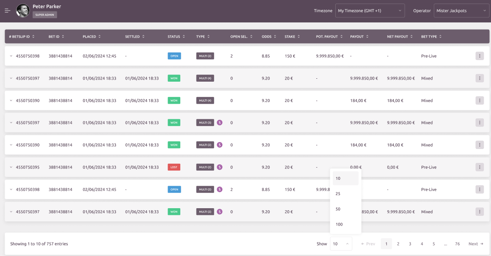

# Paurus Students

This project was generated using [Angular CLI](https://github.com/angular/angular-cli) version 19.1.6.

## Table of Contents

- [Paurus Assignment](#paurus-assignment)
  - [Requirements](#requirements)
  - [Required Technologies](#required-technologies)
- [How to start Angular application locally](#how-to-start-angular-application-locally)
- [Development Server](#development-server)
- [Code Scaffolding](#code-scaffolding)
- [Building](#building)
- [Running Unit Tests](#running-unit-tests)
- [Running End-to-End Tests](#running-end-to-end-tests)
- [GitHub CI/CD](#github-cicd)
- [Cloudflare pages](#cloudflare-pages)
  - [Manual deployment to Cloudflare page](#manual-deployment-to-cloudflare-page)
  - [First configuration](#first-configuration)
- [Release procedures](#release-procedures)
  - [Start first project release](#start-first-project-release)
  - [Release new patch version (bug-fix)](#release-new-patch-version-bug-fix)
  - [Release new minor release (feature)](#release-new-minor-release-feature)
  - [Start new major release (breaking)](#start-new-major-release-breaking)

## Paurus Assignment

Implement a simple student information system, where the user can:

- add a new student (basic student information and courses that student will be part of),
- edit the student (courses only),
- delete a student.

You will also have to implement a page with an overview of all students (a table where each row displays student information). Table
should have pagination with 20 students per page.

Try to approach its appearance, to test your HTML and CSS skills. Ignore features that are not included in task description (like timezone dropdown, expandable rows, "super admin" tag, left sidebar...)



### Requirements:

- Routing (/overview page should be lazily loaded)

### Required technologies:

- Latest Angular
- PrimeNg (component library)

## Hot to start Angular application locally

```bash
// install dependencies
npm ci

// run the server locally
npm run start

// open http://localhost:4200/ url
```

## Development server

To start a local development server, run:

```bash
ng serve
```

Once the server is running, open your browser and navigate to `http://localhost:4200/`. The application will automatically reload whenever you modify any of the source files.

## Code scaffolding

Angular CLI includes powerful code scaffolding tools. To generate a new component, run:

```bash
ng generate component component-name
```

For a complete list of available schematics (such as `components`, `directives`, or `pipes`), run:

```bash
ng generate --help
```

## Building

To build the project run:

```bash
ng build
```

This will compile your project and store the build artifacts in the `dist/` directory. By default, the production build optimizes your application for performance and speed.

## Running unit tests

To execute unit tests with the [Karma](https://karma-runner.github.io) test runner, use the following command:

```bash
ng test
```

## Running end-to-end tests

For end-to-end (e2e) testing, run:

```bash
ng e2e
```

Angular CLI does not come with an end-to-end testing framework by default. You can choose one that suits your needs.

### Cypress e2e testing

For the cypress end-to-end (e2e) testing, run:

```bash
cypress:open
cypress:run
cypress:run:debug
```

## GitHub CI/CD

On every push the GitHub Action is run and must pass before merging branches

GitHub Action run the following jobs:

- build
  - code-style
  - test-unit
  - test-e2e -> currently disabled because I have not deep dived the issue of different OS browsers environments (it works ok on local mac machine)
    - deploy-to-cloudflare-pages -> on git push the build is deployed on cloudflare

## Cloudflare pages

On every push the deployment is push to Cloudflare which can be accessed though the following links

main branch: https://paurus-students.pages.dev
particular commit: https://SHORT.COMMIT-HASH.paurus-students.pages.dev
particular branch: https://branch-name.paurus-students.pages.dev

### Manual deployment to Cloudflare page

Set token to your environment

```bash
export CLOUDFLARE_API_TOKEN=
echo "$CLOUDFLARE_API_TOKEN"
```

Build and deploy to Cloudflare

```bash
npm run build
npx wrangler pages deploy
```

### First configuration

For the new project you can set wrangler options via command line or install npm package
Command line

```bash
npx wrangler pages download config paurus-students
```

Properly config `wrangler.toml` file

## Release procedures

Command `npm version ...` will:

1. run `preversion` npm script
1. changed version in `package.json` and `package-lock.json` files
1. run `version` npm script
1. create new commit with commit message as defined in `-m` argument
1. tag this new commit message as version with `v*` prefix (examples: v1.0.0, v1.1.1-SNAPSHOT.0, ...)
1. run `postversion` npm script

### Start first project release

You should first create new release branch: `git checkout -b release-1.0` and then push it to remote repository with `git push --set-upstream origin release-1.0`.

After that you should create a tagged commit with SNAPSHOT version. You can do that by running `npm version prerelease --preid=SNAPSHOT -m "Chore: Update to version %s"`. This will create your first SNAPSHOT version **1.0.0-SNAPSHOT.0**. You can then use `npm version prerelease --preid=SNAPSHOT -m "Chore: Update to version %s"` to release additional SNAPSHOT versions. Next SNAPSHOT version in this case would be **1.0.0-SNAPSHOT.1**

When project is good enough to release a release candidate (RC) version, you should run `npm version prerelease --preid=RC -m "Chore: Update to version %s"`. You can release multiple RC versions, but you shouldn't release any SNAPSHOT versions after first RC version was released. After creating RC version, version should be **1.0.0-RC.0**, **1.0.0-RC.1** etc.

When project is good enough to release a general availability (GA) version, you should run `npm version major -m "Chore: Update to version %s"`. Project will now be versioned as **1.0.0**.

After releasing GA version, you should start new bug-fix version. You can start new bug-fix version by running `npm version prepatch --preid=SNAPSHOT -m "Chore: Update to version %s"`. This will start a new bug-fix version **1.0.1-SNAPSHOT.0**.

Then merge this branch to `master` branch.

### Release new patch version (bug-fix)

As you always start new patch version after releasing GA version, you should already be on correct SNAPSHOT version. If you are not, you should then use `npm version prepatch --preid=SNAPSHOT -m "Chore: Update to version %s"` to start new patch version. You should be on version similar to **1.0.1-SNAPSHOT.0**.

You can then use `npm version prerelease --preid=SNAPSHOT -m "Chore: Update to version %s"` to release additional SNAPSHOT versions (**1.0.1-SNAPSHOT.1**, **1.0.1-SNAPSHOT.2**, ...).

When project is good enough to release a release candidate (RC) version, you should run `npm version prerelease --preid=RC -m "Chore: Update to version %s"`. This should create version **1.0.1-RC.0**. You can release multiple RC versions, but you shouldn't release any SNAPSHOT versions after first RC version was released (**1.0.1-RC.1**, **1.0.1-RC.2**, ...).

When project is good enough to release a general availability (GA) version, you should run `npm version patch -m "Chore: Update to version %s"`. This will create version **1.0.1**.

After releasing GA version, you should start new bug-fix version. You can start new bug-fix version by running `npm version prepatch --preid=SNAPSHOT -m "Chore: Update to version %s"`. This will start a new bug-fix version **1.0.2-SNAPSHOT.0**.

Then up-merge this branch to higher `release-x.y` branches and finally `master`.

_**NOTE:** Merging different versions tree can and will sometimes cause merge conflicts. After merging, package.json and package-lock.json should have the branch current version number!_

### Release new minor release (feature)

You should first create new release branch: `git checkout -b release-1.1` and then push it to remote repository with `git push --set-upstream origin release-1.1`.

After that you should create a tagged commit with SNAPSHOT version. You can do that by running `npm version preminor --preid=SNAPSHOT -m "Chore: Update to version %s"`. This will create your first SNAPSHOT version **1.1.0-SNAPSHOT.0**. You can then use `npm version prerelease --preid=SNAPSHOT -m "Chore: Update to version %s"` to release additional SNAPSHOT versions.

When project is good enough to release a release candidate (RC) version, you should run `npm version prerelease --preid=RC -m "Chore: Update to version %s"`. This will create version **1.1.0-RC.0**. You can release multiple RC versions, but you shouldn't release any SNAPSHOT versions after first RC version was released (**1.1.0-RC.1**, **1.1.0-RC.2**, ...).

When project is good enough to release a general availability (GA) version, you should run `npm version minor -m "Chore: Update to version %s"`. This will create version **1.1.0**.

After releasing GA version, you should start new bug-fix version. You can start new bug-fix version by running `npm version prepatch --preid=SNAPSHOT -m "Chore: Update to version %s"`. This will start a new bug-fix version **1.1.1-SNAPSHOT.0**.

Then up-merge this branch to higher `release-x.y` branches and finally `master`.

_**NOTE:** Merging different versions tree can and will sometimes cause merge conflicts. After merging, package.json and package-lock.json should have the branch current version number!_

### Start new major release (breaking)

You should first create new release branch: `git checkout -b release-2.0` and then push it to remote repository with `git push --set-upstream origin release-2.0`.

After that you should create a tagged commit with SNAPSHOT version. You can do that by running `npm version premajor --preid=SNAPSHOT -m "Chore: Update to version %s"`. This will create your first SNAPSHOT version **2.0.0-SNAPSHOT.0**. You can then use `npm version prerelease --preid=SNAPSHOT -m "Chore: Update to version %s"` to release additional SNAPSHOT versions (**2.0.0-SNAPSHOT.1**, **2.0.0-SNAPSHOT.2**, ...).

When project is good enough to release a release candidate (RC) version, you should run `npm version prerelease --preid=RC -m "Chore: Update to version %s"`. This will create version **2.0.0-RC.0**. You can release multiple RC versions, but you shouldn't release any SNAPSHOT versions after first RC version was released (**2.0.0-RC.1**, **2.0.0-RC.2**, ...).

When project is good enough to release a general availability (GA) version, you should run `npm version major -m "Chore: Update to version %s"`. This will create version **2.0.0**.

After releasing GA version, you should start new bug-fix version. You can start new bug-fix version by running `npm version prepatch --preid=SNAPSHOT -m "Chore: Update to version %s"`. This will start a new bug-fix version **2.0.1-SNAPSHOT.0**.

Then up-merge this branch to higher `release-x.y` branches and finally `master`.
